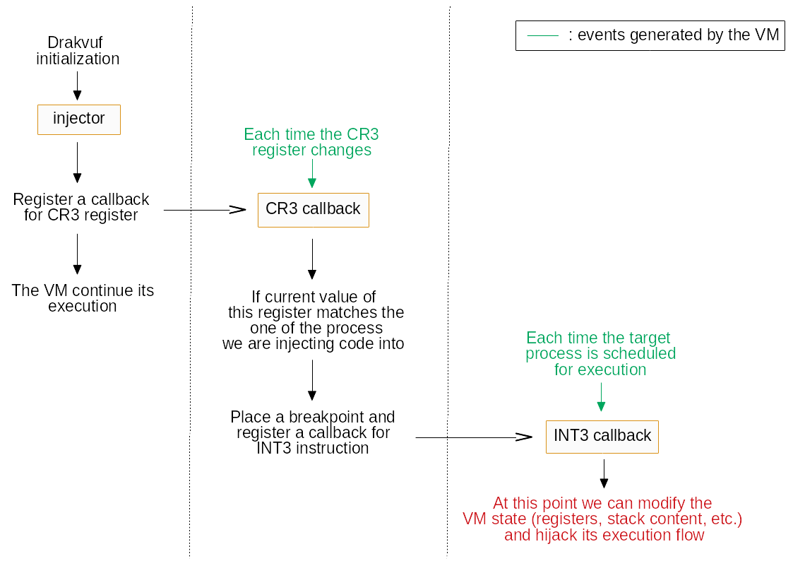
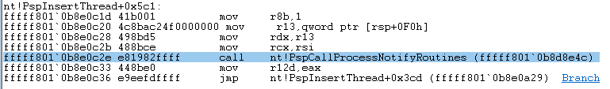

Improve process injection feature of Drakvuf
============================================

This article is part of my final evaluation for the Google Summer of Code 2018
during which I contributed to one of The Honeynet Project tool : __Drakvuf__.


The tool
--------

Drakvuf is a virtualization-based malware analysis tool that leverages Virtual
Machine Introspection (VMI). VMI is a technique to monitor the state of a
virtual machine. It can be used from the hypervisor side to monitor what's going
on inside of a VM or to alter its state. To learn more about VMI:
- <https://blog.xenproject.org/tag/virtual-machine-introspection/>


Project goal
------------

### Current code injection mechanisms

Drakvuf allows to inject a binary directly into a running virtual machine. The
current implementation uses either `CreateProcessA()` or `ShellExecuteA()` from
the Windows API, which implies to have the program we want to execute into the
guest’s filesystem. It can further lead a malware to detect the presence of
Drakvuf if we use known analysis tools. Here you can see what the code flow of
an injection looks like:



### The new one and its benefits

To solve this issue we can use a more advanced technique to inject our binary.
Among all the possibilities, the Process Doppelgänging technique seems the most
suitable. It allows to inject the binary directly into the memory, without
modification on the filesystem, by using NTFS transaction.

### What's an NTFS transaction?

NTFS Transaction (TxF) allows to consider multiple operations as a unit. This way, either all of the operations failed or succeed. If something gone wrong between the start and the end, the entire set of operations is rollbacked and the system is left as it was previously. If everything is fine, then we can commit and the system finally see the changes.

This give us the opportunity to write a file without the system noticing it.  Process doppelganging take advantage of that to create a new section for our payload in the context of a clean process. At the end, we get our program running into the guest without leaving footprints. The aim of this project is to implement all the required components into the current injector library so that we can use Drakvuf to do this type of injection.

For more details:
- <https://hshrzd.wordpress.com/2017/12/18/process-doppelganging-a-new-way-to-impersonate-a-process/>
- <https://www.youtube.com/watch?v=Cch8dvp836w&feature=youtu.be&t=2382>
- <https://github.com/mdolmen/proc_dopp>


The project
-----------

### Choosen approach

In order to implement this new injection technique, we need to hijhack the
execution flow of the target process to call multiple Windows API functions.
Before redirecting the process to the desired function we need to setup the
stack accordingly. At the beginning of the project there was multiple functions
to set the stack depending on the one to be called, so the first step was to
refactorize this code to have one universal function to simplify the process of
adding the support of a new Windows API function call.  Process doppelganging
needs a lot of function calls, it is not as straigthforward as simply calling
`CreateProcess()`. So instead of implementing every step independently from
within the injector code I choose the approach of crafting a shellcode that will
do just that. It will be generated by a C program (on a Windows system), which 
make it easier for testing/debugging and making improvements than from the hypervisor.

_Code related to this subsection_
- <https://github.com/tklengyel/drakvuf/pull/407>

### Execution of a shellcode

The logic behind executing a shellcode is pretty simple:
- allocating memory : hijacking the process with `VirtualAlloc()`
- writing shellcode into it
- hijacking the process with this address

There is one thing to not though: we can't write into the guest's memory from
the hypervisor, which VMI normally allows, directly after allocation. Here is
the why from MSDN on `VirtualAlloc()` about __MEM_COMMIT__ and __MEM_RESERVE__ :

>  Actual physical pages are not allocated unless/until the virtual addresses
>  are actually accessed.  [...] Reserves a range of the process's virtual
>  address space without allocating any actual physical storage in memory or in
>  the paging file on disk.

What we can do is adding a call to `memset()`. It will force Windows to allocate
physical pages and then we will be able to leverage VMI to write our shellcode
and every thing else we need.

_Code related to this subsection_
- <https://github.com/tklengyel/drakvuf/pull/423>

### Shellcode generation

When we have a program capable of executing a doppelganging injection, there is
a few steps to be taken care of in order to generate a __PIC__ (Posisition
Independent Code) shellcode, which is mandatory since we are going to launch it
directly from memory, without triggering the PE loader mechanisms that a normal
binary would.

Everything is very well explained here:
- <https://nickharbour.wordpress.com/2010/07/01/writing-shellcode-with-a-c-compiler/>

In a nustshell, here are the requirements:
- library function addresses must be retrieved manually, using the address of `kernel32.dll` as the starting point, which you can get thanks to the __PEB__;
- strings must be in the __.text__ section, therefore not dynamically allocated with `malloc()` or alike;
- disable Visual Studio optimizations and stack cookie protection;

After that we can write the binary data present in memory at the address of our
specifically crafted function that contains all the program logic to a file and
have it ready to be executed.

### Patching the shellcode with user inputs

We are not done yet. We want to give the user the possibility to pass data as
parameters to specify which guest binary will be used as a cover for the NTFS
transaction. To do that I instantiate an array of '0' (in the shellcode source
code) and recorded the offset at which the corresponding assembler instructions
lies in the binary code, so that I can replace the '0' by the path provided by
the user.  The end goal of the shellcode is to launch a binary present only in
memory, so the shellcode needs to be patch to contains this address too. Note
that this address has to be written in little-endian (the less significant byte
first).

### Kernel debugging to bypass a function call

Since a recent Windows update (version 1803) a new difficulty
arisen : the final step of the shellcode, a call to `NtCreateThreadEx()`, didn't
work anymore and returned __ERROR_ACCESS_DENIED__. I had to debug the Windows kernel
to find out why. I knew what return code I was looking for and after some _step
over_ / _step into_, I came with the following tree call:
```
NtCreateThreadEx() -> PspCreateThread() -> PspInsertThread() -> PspCallProcessNotifyRoutines()
```
Its the last one that bothers us. If we look closer at what it does, we can
observe that at some point it iterates over an array to perform some checks, one
of which triggers the termination of the almost created process.

> When you run an executable, most Antiviruses will catch the operation by a kernel callback (nt!PspCallProcessNotifyRoutines and nt!PsCallImageNotifyRoutines) and then scan the file, most commonly by requesting its user-mode agent using to do so, using ioctls/fastio/sharedmem/APC/etc.

Source: 
<https://www.cyberark.com/threat-research-blog/illusion-gap-antivirus-bypass-part-1/>

Since I've done my test with __mimikatz__ as a payload it make sense. We can bypass
this check though by not calling this function at all. Drakvuf uses a rekall
profile to get information about the VM kernel. We can use this profile to get
the relative virtual address (RVA) of that function and place a breakpoint on
it.



When a program call a function, the address of the next instruction is pushed
onto the stack (which make the stack pointer decrease) and then replace __RIP__
with the call destination. So to bypass the call to a function all we have to do
(when the breakpoint is hit) is to restore the saved __RIP__ from the stack and
increase the stack pointer ( __RSP__ ) of the size of an address.

_Code related to the last 3 subsections_
- <https://github.com/tklengyel/drakvuf/pull/444>


Limitations
-----------

Now we're done! At this point, simple standalone binaries can be injected
successfully into a VM, without having it into the VM filesystem.

It's a good start but there are still limitations and room for improvements.
Certain programs failed to find some DLLs or display an error message before
to quit (especially when using the .Net framework). I think some of these errors
are due to the empty environment variables for the newly created process.

Also, after a successful injection subsequent attempts targetting the same
process will fail. I would need better knowledge in process internals to find
out the root cause of this issue.

Personal experience
-------------------

It was an amazing experience! I had very little knowledge on virtualization and
I have know a better understanding of how things work.

The hardest problem I had to face during this project was to understand the
execution flow of the tool and the interaction between its different components
because it was my first experience on such a complexe program and because I had
to understand an already existing source code written by others.

I learned a lot about operating system internals related to processes and
especially what mechanisms we can use to know, from an hypervisor perspective,
which process is currently executing in a virtual machine. I also had the
opportunity to experiment with a real-world kernel debugging use case which was
really cool.

Now my plan is to continue to learn even more about OS internals, kernel
development and the ARM architecture. My goal is to continue to contribute to
project related to hypervisor technology and to help bring VMI to ARM processor.


Credits
-------

Thank you very much to my mentor @tklengyel who has been a great help during
this project, as well as @vpbalint, the GSoC team behind the organization and of
course The Honeynet Project for giving me the opportunity to participate to this
event!
